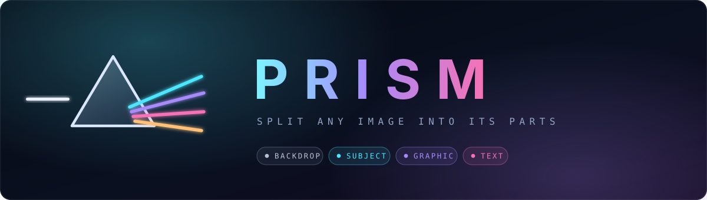

<div align="center">



<br>

**A prism splits one beam into its colours.**
**Prism splits one flat image into the layers it was built from.**

<br>

[](https://www.python.org)
[](tests/test_pipeline.py)
[](#every-neural-backend-is-optional)
[](#what-you-get-back)
[](LICENSE)

</div>

<br>

Give Prism a poster, advert or social creative. It returns the pieces a designer would have started with — a clean background plate, matted subject cut-outs, isolated graphic elements and separated text blocks — each with an alpha channel, a bounding box, a depth index and a confidence score.

Then it rebuilds the stack in 3D so you can orbit through the decomposition.

<br>

```bash
git clone <your-repo-url> && cd PRISMA
./run.sh
```

That's it. `run.sh` builds a virtualenv, installs what's needed, checks the optional backends and opens **http://localhost:7860**.

<br>

---

## Contents

[Quick start](#quick-start) · [What you get back](#what-you-get-back) · [How it works](#how-it-works) · [Design decisions](#design-decisions) · [The 3D viewer](#the-3d-viewer) · [Results](#results) · [Limitations](#honest-limitations) · [API](#api) · [Deployment](#deployment)

---

<br>

## Quick start

### One command

```bash
./run.sh                # set up if needed, then serve on :7860
./run.sh --full         # also install the neural backends (large)
./run.sh --port 8000    # different port
```

### Manual

```bash
pip install -r requirements.txt
python app.py
```

### Docker

```bash
docker compose up --build
```

### Text recognition

Tesseract is the one non-pip dependency. Without it, text layers are still **detected and cut out correctly** — you just get empty strings instead of the recognised copy.

```bash
brew install tesseract                                          # macOS
sudo apt-get install tesseract-ocr tesseract-ocr-eng            # Debian/Ubuntu
winget install UB-Mannheim.TesseractOCR                         # Windows
```

### Command line

```bash
python cli.py poster.png -o out/            # one image
python cli.py ./images -o out/ --workers 4  # a directory, in parallel
python cli.py poster.png --classical        # force the weights-free path
python cli.py poster.png --merge-text       # all copy as one combined layer
```

### As a library

```python
from prism import Prism, Config
from prism.exporters import export_all

result = Prism().decompose(rgb_array, source_name="poster")
export_all(result, rgb_array, "out/")

for layer in result.sorted_layers():
    print(layer.z, layer.kind, layer.label, layer.bbox)
```

<br>

---

## What you get back

```
out/poster/
├── layers/
│   ├── 00-background-background-plate.png
│   ├── 01-subject-subject.png
│   ├── 06-graphic-logo-mark.png
│   └── 09-text-choose-your-energy.png
├── manifest.json        kind, label, depth, bbox, colour, text, confidence
├── poster.psd           layered, correctly stacked, opens in Photoshop
├── recomposite.png      the stack flattened — compare against source
├── source.png
└── poster-layers.zip
```

Layers are cropped to their bounding box with the offset recorded in the manifest, so files stay small and nothing is lost. The PSD stores layers cropped with offsets too, exactly as Photoshop expects — that alone took the sample PSD from 63 MB to 6.5 MB.

```json
{
  "kind": "text",
  "label": "text \"Choose your energy, every day.\"",
  "z": 13,
  "confidence": 0.83,
  "bbox": [104, 402, 618, 811],
  "color": [58, 74, 52],
  "text": "Choose your energy, every day.",
  "file": "layers/13-text-choose-your-energy.png",
  "meta": { "offset": [104, 402], "size": [514, 409] }
}
```

**Separate text blocks or one layer?** By default each block becomes its own asset — that matches how a layered source file is actually built, and preserves more information, since a reviewer can merge layers but cannot unmerge them. Pass `--merge-text`, or tick the toggle on the landing page, to emit all copy as a single removable overlay instead.

<br>

---

## How it works

Six stages, each independently testable, each with a graceful fallback.

<table>
<tr><td width="46%">

**1 · Backdrop modelling**

</td><td>

Designed creatives sit on a designed backdrop, so it is learned *before* any segmentation and every later stage uses it as a prior. Border pixels are clustered in CIE-LAB — perceptually uniform, so one distance threshold behaves the same across hues — and sparse clusters are discarded, which stops bunting, frames and ornaments that touch the edge being mistaken for background. A quadratic colour surface is then fitted over the confident background pixels, so vignettes and duotone gradients are followed instead of torn out.

</td></tr>
<tr><td>

**2 · Text detection**

</td><td>

Text is what designers most want back and what generic segmentation handles worst: a headline is not a salient object, and its glyphs are disconnected components. With `easyocr` installed, CRAFT does the detection. Without it, a three-tier bottom-up analysis runs — glyph candidates from adaptive thresholding **and** quantised colour planes (an orange word inside a dark-green headline has almost no luminance contrast), filtered by geometry and stroke-width consistency; then lines by union-find over vertical overlap, height similarity and proximity; then blocks from aligned stacked lines. Blocks matter: a headline set over four lines is one asset, not four.

</td></tr>
<tr><td>

**3 · Subject matting**

</td><td>

`rembg` (U²-Net / IS-Net) when weights are available, otherwise spectral-residual and fine-grained saliency fused with the backdrop prior and a centre bias, refined with GrabCut. Either way, an oversized silhouette is split by distance-transform watershed — the distance field peaks once per figure, so those peaks seed per-object regions that watershed grows back along real edges. Without this a group shot returns as one layer covering half the canvas, which is not a decomposition.

</td></tr>
<tr><td>

**4 · Graphic classification**

</td><td>

Whatever survives is design furniture: logos, icon rows, badges, frames, rules, ornaments. No off-the-shelf model segments these, so the method is structural. Each element is scored by a **photographic-vs-vector discriminator** built from colour diversity, *interior* gradient activity (flat fills are near-zero inside a shape even when their edges are hard) and local variance energy. A structural text test runs first, because gradient-filled display type scores as photographic and would otherwise be emitted as a person.

</td></tr>
<tr><td>

**5 · Background reconstruction**

</td><td>

The background is the one layer that must cover the whole canvas. LaMa when installed; otherwise a structural fill — iterative coarse diffusion at ¼ scale, which recovers gradients almost exactly on flat and gradient backdrops — blended with Telea by depth into the hole. Telea near known pixels for detail, structural deep inside where diffusion would smear.

</td></tr>
<tr><td>

**6 · Depth ordering**

</td><td>

Z-order comes from layer kind, then occlusion evidence where two layers contest pixels, then area. Layers are then separated by **front-to-back alpha compositing**, not a binary mask subtraction — thresholding soft edges would let every anti-aliased boundary be claimed twice. Per pixel the emitted alphas sum to at most 1 by construction, so the partition is exact.

</td></tr>
</table>

<br>

---

## Design decisions

### Every neural backend is optional

The pipeline runs end to end with **zero downloaded weights**. `prism/backends.py` probes each capability and the pipeline transparently upgrades when one is present — same code path, same output contract. The manifest and the UI both report which backend actually served each stage, so results are never ambiguous about what ran.

This is a deliberate robustness property, not a workaround: it works on an air-gapped machine, in a locked-down CI runner and on a laptop with no GPU, and gets *better* — not different — when you install the extras. CI proves it on every push by running the suite twice, once with `LAYERFORGE_CLASSICAL=1`.

### Correctness is measured, not asserted

Every run recomposites its own layer stack and reports MAE and PSNR against the source. If a decomposition is wrong, the number says so. That metric appears in the manifest, the CLI output and the UI header.

### Bounded working resolution

Segmentation runs at a capped resolution for predictable latency; masks are resampled to full resolution before export, so output fidelity is set by the source image, not the working size. A 2200×2933 input processes as fast as a 1400 px one and still exports at full size.

<br>

---

## The 3D viewer

Each layer becomes a textured plane positioned from its manifest bounding box, so the stack reproduces the original composition exactly — then separates along Z by its computed depth.

**Explode** sets depth spacing. **Spread** fans layers into an arc so dense stacks stay legible. Hovering isolates a layer and dims the rest; clicking focuses the camera. **Flatten** returns to a head-on view of the reassembled composition. **Cinematic FX** toggles the heavier effects.

Layer planes are unlit by design — source pixels shown faithfully rather than re-shaded, because the point is to inspect the decomposition, not relight it. Everything around them does the atmospheric work: a volumetric fbm-noise nebula, mirrored floor reflections that fade with height, bloom, fog, a parallax starfield, and a single grade pass carrying vignette, chromatic aberration and film grain.

When an image is uploaded it becomes a 3D plate that a **scanline sweeps** while the pipeline runs — with real prism dispersion at the scan head, the three channels fanning out exactly as the name implies.

Camera framing is computed from the stack's bounding box rather than hardcoded, so any aspect ratio fits. Scripted camera moves are cancellable and yield the instant you touch the scene, and a click is distinguished from an orbit-drag so rotating never selects a layer by accident.

Progress streams over server-sent events, so each stage lights up as it completes. If SSE is blocked by a proxy, the client falls back to polling.

<br>

---

## Results

Recomposite PSNR against the source, measured by the pipeline itself. Both tables were produced on the **classical path with no model weights** — these are a floor, not a ceiling.

**Provided samples**

| Image | Layers | PSNR |
|:--|--:|--:|
| festival — dense collage | 25 | 32.1 dB |
| jewels — dark, ornate | 28 | 37.1 dB |
| wellness — light, editorial | 21 | 34.2 dB |
| reference decomposition | 28 | 37.3 dB |

**Held-out images**, structurally unlike the samples, including deliberately pathological cases

| Image | Size | Layers | PSNR | Result |
|:--|:--|--:|--:|:--|
| dark tech poster | 1600×900 | 9 | 45.4 dB | text, subject and graphics separated |
| light minimal | 1000×1000 | 7 | 55.0 dB | 3 text blocks, product isolated |
| tall story format | 1080×1920 | 6 | 59.3 dB | photo-heavy, no text present |
| wide strip banner | 2400×80 | 2 | 54.3 dB | 30:1 aspect, no crash |
| pure noise | 500×500 | 4 | 40.1 dB | degrades sensibly |
| pure white | 400×400 | 1 | 99.0 dB | correctly emits background only |

**Test suite — 21 tests, passing in both auto and forced-classical mode.**

```bash
python -m pytest tests/ -v
LAYERFORGE_CLASSICAL=1 python -m pytest tests/ -v   # prove the weights-free path
```

Tests use synthetic fixtures with known ground-truth structure rather than the sample images, so they verify behaviour instead of memorised output. They cover the layer contract (dense unique z-order, exactly one full-canvas background, non-overlapping content layers), correctness (recomposite PSNR, the photo-vs-vector discriminator, gradient backdrop modelling), robustness (grayscale, uniform, 32×32 and 2200×2933 inputs, determinism) and export integrity.

<br>

---

## Honest limitations

**Dense collage artwork is the hard case for the classical path.** Where figures and props touch, they form one connected region. Watershed splitting recovers most of it, but installing `rembg` is the real fix — which is exactly why the neural path exists. This is a limitation of the fallback, not the design.

**Text recognition is weaker than text detection.** Stylised display and script faces are reliably *located* and cut out correctly, but Tesseract often misreads them. The layer geometry is right even when the transcribed string is not; recognised text is metadata, never a gate on whether a layer is emitted. `easyocr` improves both.

**Layer semantics are heuristic, not learned.** Graphic labels come from transparent geometry rules — aspect, fill, position, size. They are auditable and need no weights, but they are not a substitute for a zero-shot classifier. `stages/graphics.py::_describe` is a drop-in slot for CLIP without changing the layer contract.

**The viewer needs a network on first load.** Three.js is loaded from unpkg via importmap. Vendor it locally for a fully offline deployment.

<br>

---

## API

| Method | Route | Purpose |
|:--|:--|:--|
| `POST` | `/api/decompose` | Upload an image; returns a job id immediately |
| `GET` | `/api/jobs/{id}/events` | SSE stream of live stage progress |
| `GET` | `/api/jobs/{id}` | Status, and the manifest once complete |
| `GET` | `/api/jobs/{id}/file/{path}` | An individual layer PNG |
| `GET` | `/api/jobs/{id}/download` | The full ZIP bundle |
| `GET` | `/api/health` | Version and active backend report |

Jobs run on a worker thread pool so uploads never block the event loop. Uploads are capped at 25 MB, job directories are TTL-purged, and layer paths are contained against traversal.

| Variable | Default | Purpose |
|:--|:--|:--|
| `PORT` | `7860` | HTTP port |
| `PRISM_WORKERS` | `2` | Concurrent decomposition threads |
| `PRISM_MAX_UPLOAD` | `26214400` | Upload cap in bytes |
| `PRISM_JOB_TTL` | `3600` | Seconds before job output is purged |
| `LAYERFORGE_CLASSICAL` | unset | Set to `1` to force the weights-free path |

<br>

---

## Deployment

Full per-platform instructions in **[deploy/README.md](deploy/README.md)** — Hugging Face Spaces, Docker, Render, Fly.io, Railway and a bare VPS with systemd.

Config files are already in the repo: `Dockerfile`, `docker-compose.yml`, `render.yaml`, `fly.toml`, `.dockerignore` and a GitHub Actions workflow that runs the suite on Python 3.10–3.12 plus an end-to-end decomposition with integrity assertions.

<br>

---

## Project layout

```
prism/
├── config.py           every threshold, in one place
├── backends.py         optional-dependency probing, graceful degradation
├── types.py            Layer / Decomposition contracts
├── imaging.py          guided filter, texture metric, watershed, mask algebra
├── pipeline.py         stage orchestration + progress streaming
├── exporters.py        PNG, manifest, PSD, ZIP, quality metrics
└── stages/
    ├── backdrop.py     background colour + gradient model
    ├── text.py         glyph → line → block analysis
    ├── subject.py      salient matting, neural or classical
    ├── graphics.py     photo-vs-vector discrimination
    ├── reconstruct.py  three-tier inpainting
    └── ordering.py     z-order + alpha partitioning
app.py                  FastAPI service, SSE progress
cli.py                  batch CLI
static/index.html       3D viewer
tests/                  21 tests
deploy/                 per-platform deployment guide
```

<br>

<div align="center">

Built by **Ankit Singh** · MIT licensed

</div>
